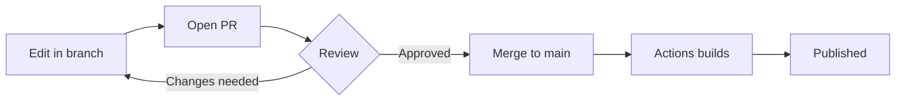

# Component reference

## Cards

<div class="grid cards" markdown>

-   :material-rocket-launch:{ .lg .middle } **Getting started**

    ---

    Laptop, accounts and access in under an hour.

    [:octicons-arrow-right-24: Onboarding](onboarding.md)

-   :material-shield-lock:{ .lg .middle } **Security**

    ---

    Policies, incident reporting, and access requests.

    [:octicons-arrow-right-24: Read more](#)

-   :material-account-group:{ .lg .middle } **Teams**

    ---

    Who owns what, and where to ask questions.

    [:octicons-arrow-right-24: Read more](#)

</div>

[Primary action](#){ .md-button .md-button--primary }
[Secondary](#){ .md-button }

## Tabbed content

=== "macOS"

```bash
    brew install git
```

=== "Windows"

```powershell
    winget install Git.Git
```

=== "Linux"

```bash
    sudo apt install git
```

## Diagrams



## Annotated code

```yaml
theme:
  name: material  # (1)!
  features:
    - navigation.tabs  # (2)!
```

1.  The theme package, installed via pip.
2.  Turns top-level nav into a horizontal tab bar.

## Callouts

!!! warning "Access required"
    Requires SSO membership in the platform group.

??? note "Collapsed by default"
    Useful for long reference material you don't want dominating the page.

## Checklists

- [x] Repository created
- [x] Pages enabled
- [ ] Custom domain configured

## Tooltips

Hover over SSO to see the definition.

*[SSO]: Single Sign-On
